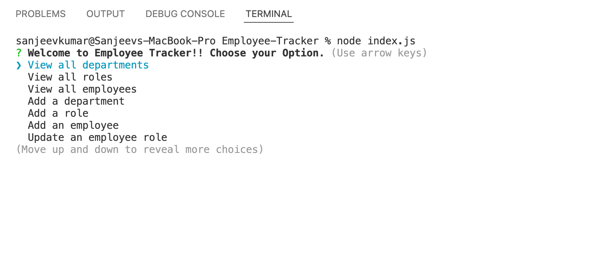
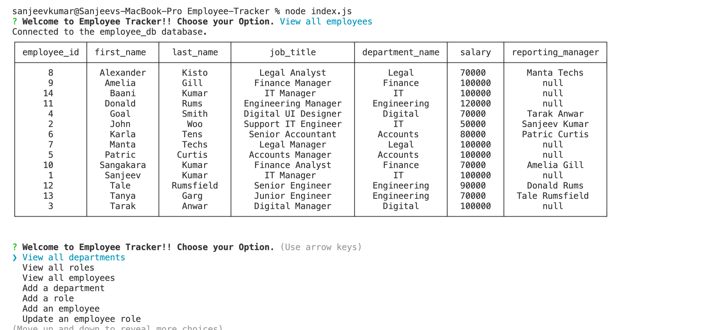
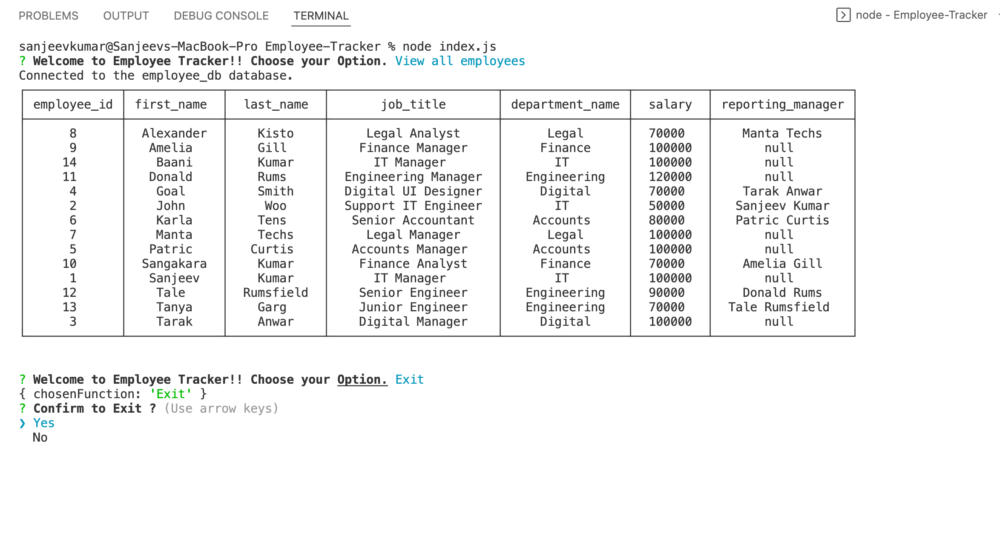

# Employee Tracker

[Demo URL 1 ](https://drive.google.com/file/d/1MdB80fHt5sXJed4m-qgo9gXkOaKxrfPD/view)

[Demo URL 2 ](https://drive.google.com/file/d/1XBMSFCPsSaP8IIvZbMbJF4cKT8n7mZ-B/view)

[Repository URL ](https://github.com/SanjeevKumar-DEV/Employee-Tracker)

## Description

> It is command line application for business 
> owner to view and manage the departments, 
> roles, and employees in a company to 
> organize and plan business. 

## Table of Contents

- [Installation](#Installation)
- [Usage](#Usage)
- [Contributing](#Contributing)
- [Tests](#Tests)
- [Questions](#Questions)
- [License](#License)

## Installation

Clone the repository using the repository URL as mentioned below.
```
Git clone git@github.com:SanjeevKumar-DEV/Employee-Tracker.git
```
Open Terminal and go to cloned repository location and start code editor
```
Code .
```

## Usage

> Start the application by typing commnad on terminal 'node index.js'  

 

> Select any available option from Menu. As an example 'View All Employees' and Press Enter   

 

> Continue to use rest of the menu options as you want or choose option to Exit. 

 


## Contributing

> Contribution guidelines development is in progress. 

 


## Tests

> Test Development strategy is in progress. 

## Questions

> Q1. What is my link to my github profile ? 
Answer: [Github Username](https://github.com/SanjeevKumar-DEV) 

> Q2. How to reach me with additional questions ? 
Answer: [Contact Email](mailto:sanjeevkumar@me.com)

## License

> License agreement is covered under guidelines and agreement of GitHub and Microsoft and MySQL.
